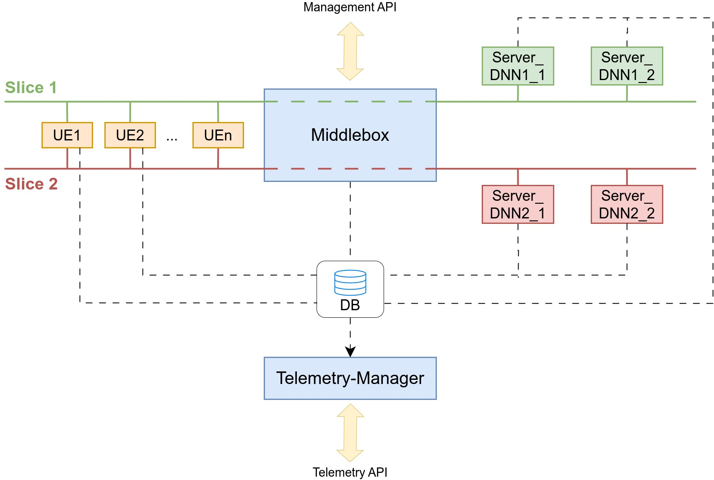

# PhyTwin Architecture (v1.0)

**PhyTwin** è una piattaforma di emulazione ed esperimentazione di rete 5G/Slice basata su container Docker, focalizzata sulla gestione dinamica di nodi UE (User Equipment), modellazione di regole traffic control (TC/PCC) e monitoraggio in tempo reale tramite Telemetry Manager.

---

## Architettura del Sistema

- **Middlebox (FastAPI - Porte `8000`)**: Orchestratore centrale responsabile dello spawn dei container UE, applicazione delle policy di routing/slice e regole PCC/AMBR.
- **UE Agents (`ue-image:latest`)**: Container leggeri legati ad interfacce di rete emulate per l'esecuzione di test iPerf3.
- **Telemetry Manager**: Componente dedicato alla raccolta e persistenza delle metriche di prestazione di rete e sistema.
- **DNN Server**: Endpoint di terminazione dati per il traffico delle slice emulate.




---

## Quick Start

### Avvio dell'Architettura
```bash
# Avvio standard con file di configurazione UE
python3 scripts/startup/phytwin_start.py --config scripts/startup/config.example.yaml

# Riavvio completo con rebuild e pulizia dei DB
python3 scripts/startup/phytwin_start.py -r -b -c scripts/startup/config.example.yaml
